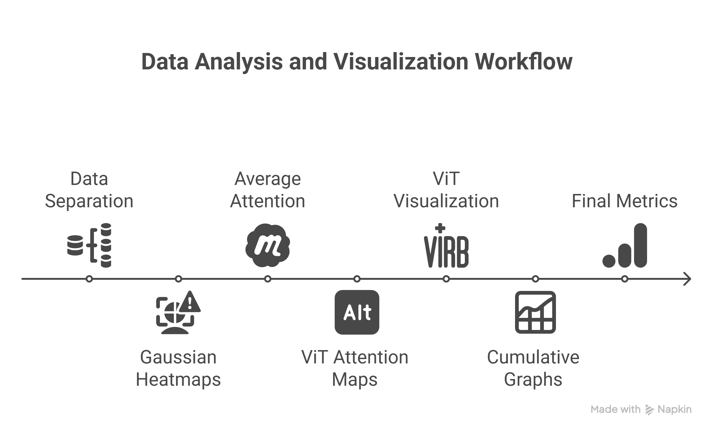
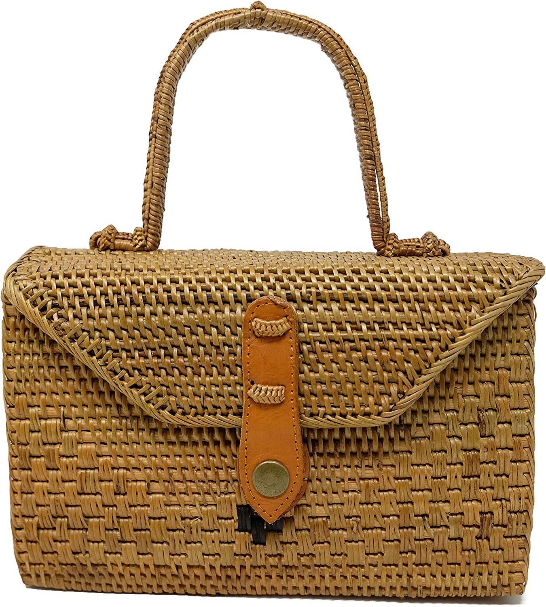
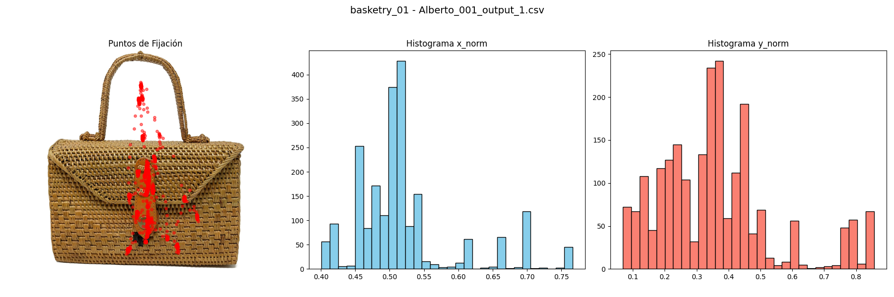
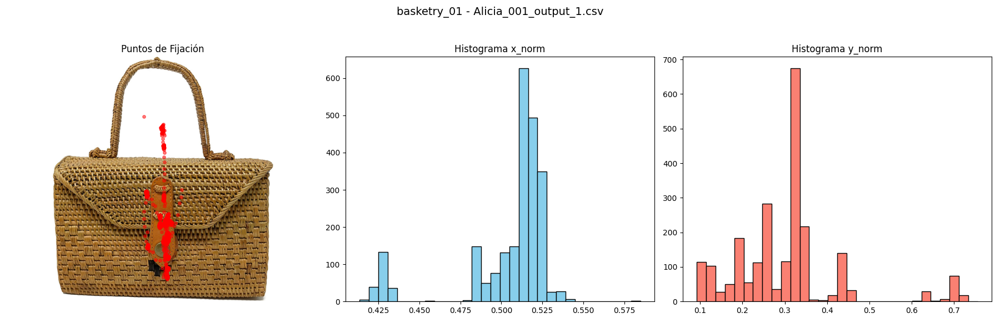
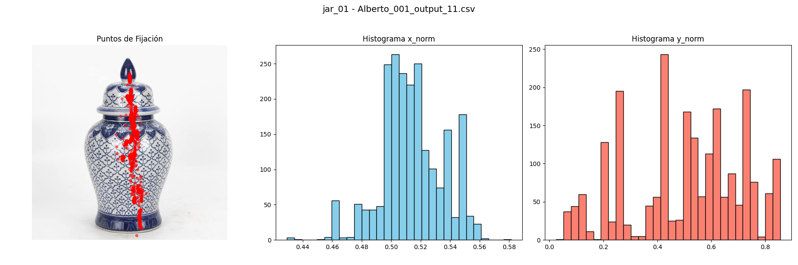
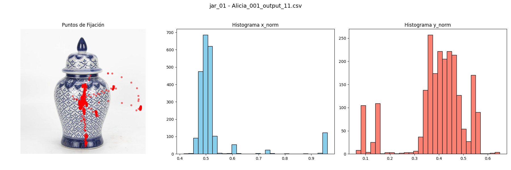

# Comparative Perspective of Visual Attention: From Human Focus to Visual Transformers. An In-Depth Review

Although neuroscience has made considerable progress in recent decades by proposing robust models that explain the mechanisms of attention and perception in humans, emulating this capability using computational techniques remains complex. It was not until the development of models such as Visual Transformers (ViT) that it became possible to partially replicate this uniquely human trait. The main objective of this study was to explore the extent to which attention models, such as ViT, can reproduce the manner in which people distribute their visual attention when exposed to various stimuli, particularly in the context of handcrafted objects. Human fixations (i.e., attention) were recorded using an eye tracker, while the ViT model processed the same images to generate attention maps to evaluate the degree of similarity between the two patterns. For this purpose, heatmaps were constructed, and quantitative metrics were applied to assess their similarity. The results revealed areas of convergence and significant differences, highlighting the current limitations of computational models in capturing the more subtle aspects of human perception. This comparison not only helps us better understand the capabilities of ViT but also provides a foundation for reflecting on future improvements in automated attention models and their potential applications in contexts where visual interpretation is crucial.

# Visual Attention and Vision Transformers repository

This repository contains the code and experimental results for analyzing and comparing human attention maps with the attention generated by Vision Transformer (ViT) models.
The goal is to evaluate similarities and differences between human visual attention and the learned attention in transformer-based models.

## 📂 Repository structure
### Codes/
Contains all scripts and notebooks required to run the experiment in the order specified below.

### experiments_pictures/
Contains the input images and the results generated during the experiments.

## ▶️ Execution order
To fully replicate the experiment, run the scripts and notebooks inside the Codes/ folder in the following order:

1. data separation by matrix.py
        Separates and organizes input data for subsequent analysis.

2.  heatmap_hum_gaussiano_step1.ipynb
        Generates Gaussian-based heatmaps from human attention data.

3. gmm_avg_human_att.py
        Computes the average human attention using Gaussian Mixture Models.

4. heatmap_vit_step2.ipynb
        Generates the Vision Transformer attention maps.

5. Visualizing_in_ViT_step2.py
        Processes and visualizes the ViT attention outputs.

6. graphs_cum_avg_median.py
        Creates cumulative graphs and calculates statistical measures such as mean and median.

7. Metrics_and_figures.py
        Computes comparison metrics and generates the final figures for the analysis.

## 📊 Execution flow diagram

  

## 📷 Experimental Images

Inside the `experiments_pictures/` folder you will find:

- **`basketry_images/`** – Original experiment images for the *basketry* object.  
- **`basketry_stats/`** – Gaze position surface maps for each participant, together with their X and Y normalized histograms.

- **`jar_images/`** – Original experiment images for the *jar* object.  
- **`jar_stats/`** – Gaze position surface maps for each participant, together with their X and Y normalized histograms.

### 👜 Basketry – Examples
**Original image**

  

**Participant results**

   
  

### 🏺 Jar – Examples
**Original image**

  

**Participant results**

   
  

## ⚙️ Requirements
Python 3.8 or higher

### Required libraries: 
        numpy pandas matplotlib seaborn scikit-learn torch torchvision tensorflow

## 🚀 How to run

### Clone the repository:
        1. git clone https://github.com/luis-oliveros/Visual_Attention_and_ViT.git
        2. cd Visual_Attention_and_ViT
        3. Install the dependencies listed in the Requirements section.

Run each script or notebook following the order in the Execution order section.

All generated results will be automatically saved in the experiments_pictures/ folder.

## 📄 License
This project is licensed under the MIT License. See the LICENSE file for details.

